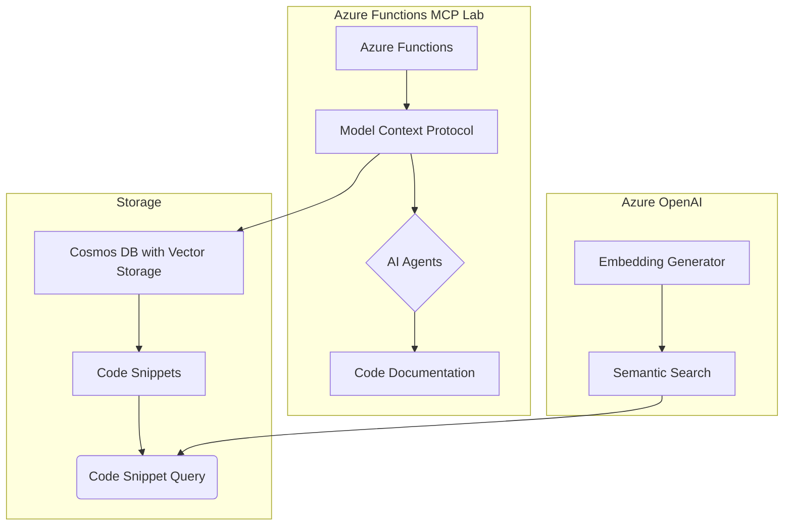
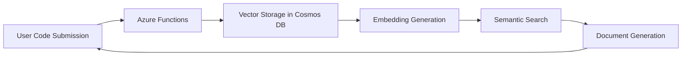

# Azure Functions MCP Lab Project Documentation

## Project Overview

The Azure Functions MCP Lab project, named "snippy," is designed to demonstrate the capabilities of Model Context Protocol (MCP) for managing code snippets. This project leverages cutting-edge technologies including Azure Functions v4, Azure AI Agents, Cosmos DB, and Azure OpenAI. It provides a comprehensive platform for storing, retrieving, and generating documentation for code snippets. Key functionalities include code snippet management using AI-enhanced techniques, semantic search, and dynamic documentation through AI agents.

## Key Concepts

### Azure Functions
- **Version**: v4
- **Language**: Python 3.11
- **Pattern**: Usage of async/await patterns

Azure Functions provide a serverless computing environment that enables the execution of Python code triggered by events. In this project, Azure Functions are employed to handle various tasks related to MCP operations, including snippet storage and processing.

### Model Context Protocol (MCP)
MCP is central to the project's architecture, facilitating the management and retrieval of code snippets. It leverages AI-enhanced mechanisms for contextual understanding and semantic processing of code snippets.

### Azure AI Agents Service
This service is used for generating documentation and style guides. Key components such as `code_style.py` and `deep_wiki.py` utilize this service to produce comprehensive and contextually relevant documentation.

### Cosmos DB with Vector Storage
Cosmos DB serves as the storage layer for code snippets, with enhanced capabilities for vector storage. This allows efficient semantic search and retrieval operations, essential for the MCP functionality.

### Azure OpenAI for Embedding Generation
Azure OpenAI plays a crucial role in embedding generation and semantic search, enabling advanced code snippet retrieval based on meaning rather than keywords alone.

## System Architecture Diagram

## Data Flow Diagram

## Snippet Catalog

The snippet catalog should list each available code snippet in the database, with brief descriptions of their purpose and relationships within the project. As the search returned no snippets, we advise populating this section with following structure:

- **Snippet ID**: Unique identifier for each snippet
- **Language**: Programming language used in the snippet (Python)
- **Purpose**: One-line description of the snippet's functionality

## Usage Walkthroughs

### Code Snippet Submission and Retrieval
1. **Submit a Code Snippet**: Users submit code snippets to Azure Functions, where MCP processes them and stores them in Cosmos DB.
2. **Embedding Generation**: Azure OpenAI generates embeddings for the stored snippets.
3. **Semantic Retrieval**: Users can perform semantic searches on Code Snippets based on embeddings.

### Documentation Generation
1. **Trigger Documentation**: Invoke AI Agents to generate style guides and documentation.
2. **Documentation Processing**: AI Agents process existing snippets and produce relevant documents.
3. **Access Generated Documentation**: Users can review documentation tailored to current snippets.

## Best Practices

- Utilize async/await patterns for efficient event-driven programming in Azure Functions.
- Ensure robust error handling within functions to manage unforeseen failures.
- Maintain code consistency with established style guides via `code_style.py`.
- Regularly update vector embeddings to keep semantic search results relevant.

## Anti-patterns

- Avoid synchronous blocking operations inside Azure Functions to maintain performance.
- Do not store sensitive information directly in code snippets or accompanying metadata.

## TODOs

- Implement improved logging mechanisms for monitoring and debugging Azure Functions.
- Enhance security measures for data in Cosmos DB using encryption at rest.

## Further Reading

- [Azure Functions Documentation](https://docs.microsoft.com/en-us/azure/azure-functions/)
- [Cosmos DB Documentation](https://docs.microsoft.com/en-us/azure/cosmos-db/)
- [Azure OpenAI Service Overview](https://docs.microsoft.com/en-us/azure/cognitive-services/openai/overview)

This documentation serves as a guide to the Azure Functions MCP Lab project, outlining its architecture, usage, and best practices. As the project progresses, your contributions in code and documentation can help refine this comprehensive framework.